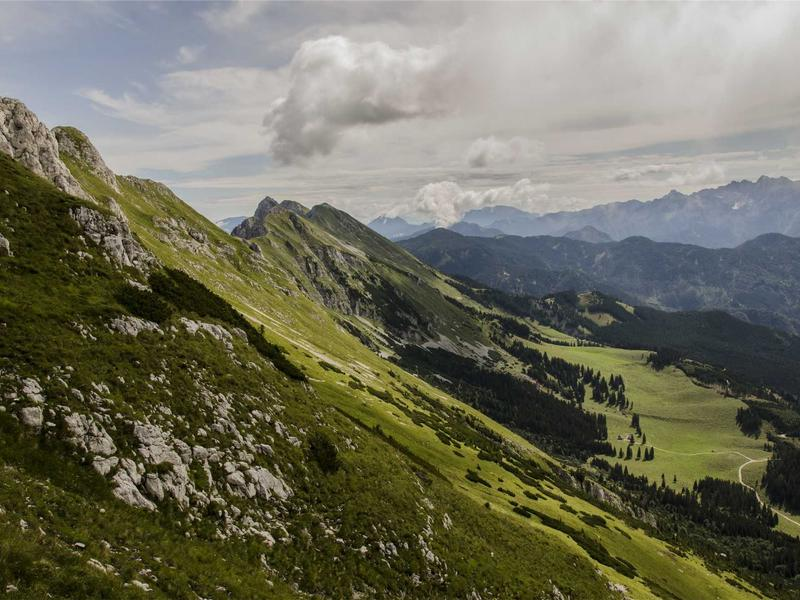

# Level 5 Master Level

Maximum depth achieved! Five levels of nesting.

Path: `en/_13_Complete_Test/_01_Nested_Level_1/_01_Nested_Level_2/_01_Nested_Level_3/_01_Nested_Level_4/_01_Nested_Level_5/`

## The Master Equation

Einstein field equations:

$$
\log_b(xy) = \log_b x + \log_b y
$$

## Quantum Computing

```python
from qiskit import QuantumCircuit, execute, Aer

# Create a quantum circuit
def create_bell_state():
    """Create a Bell state."""
    qc = QuantumCircuit(2, 2)
    qc.h(0)
    qc.cx(0, 1)
    qc.measure([0, 1], [0, 1])
    return qc

# Execute
simulator = Aer.get_backend('qasm_simulator')
job = execute(create_bell_state(), simulator)
result = job.result()
print(result.get_counts())
```

## Post Component at Max Depth

<post>
<lft>

This post component is at the deepest nesting level. It demonstrates that the VMD post component works correctly regardless of folder depth.

Features demonstrated:
- Deep nesting support
- Image rendering at any level
- Math formulas: $E = mc^2$

</lft>
<rt>




</rt>
</post>

## Congratulations

You have reached the deepest level of the test documentation structure!
